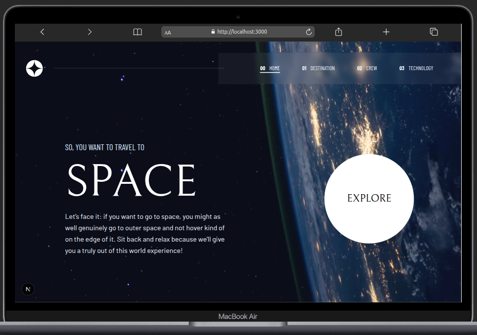
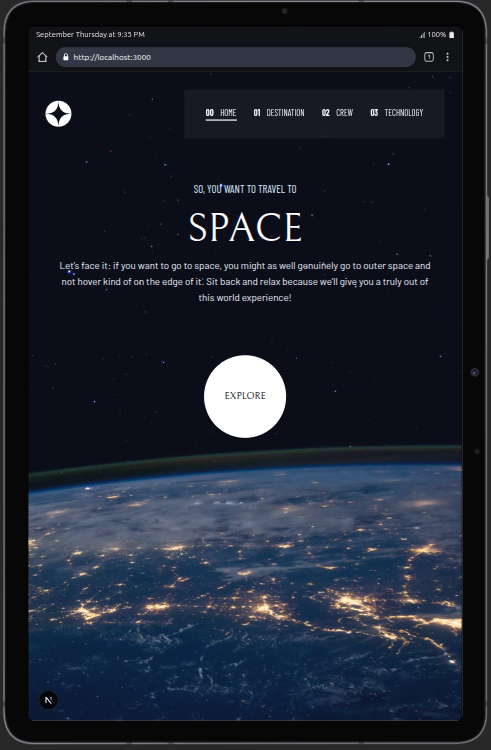
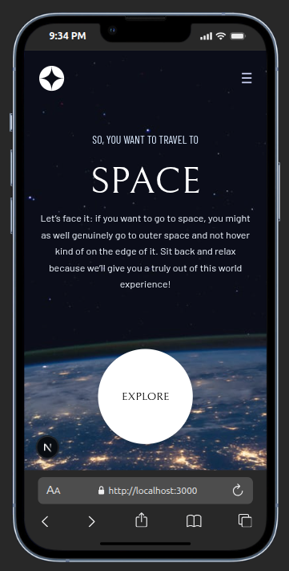

# Frontend Mentor - Space tourism website solution

This is a solution to the [Space tourism website challenge on Frontend Mentor](https://www.frontendmentor.io/challenges/space-tourism-multipage-website-gRWj1URZ3).  
Frontend Mentor challenges help you improve your coding skills by building realistic projects.

## Table of contents

- [Overview](#overview)
  - [The challenge](#the-challenge)
  - [Screenshot](#screenshot)
  - [Links](#links)
- [My process](#my-process)
  - [Built with](#built-with)
  - [What I learned](#what-i-learned)
  - [Continued development](#continued-development)
  - [Useful resources](#useful-resources)
- [Author](#author)
- [Acknowledgments](#acknowledgments)

---

## Overview

### The challenge

Users should be able to:

- View the optimal layout for each of the website's pages depending on their device's screen size
- See hover states for all interactive elements on the page
- View each page and toggle between tabs to see new information

### Screenshot





### Links

- **Solution URL:** [Add solution URL here](https://github.com/teesmile/space-tourism)
- **Live Site URL:** [Add live site URL here](https://space-tourism-toni.vercel.app/)

---

## My process

### Built with

- Semantic **HTML5** markup
- **Tailwind CSS** for utility-first styling
- **Flexbox** & **CSS Grid** for layout
- **Mobile-first** responsive workflow
- **React** for component-based UI
- **Next.js** for routing and performance optimizations
- **TypeScript** for type safety
- **Framer Motion** for smooth animations

### What I learned

This project reinforced my skills in:

- Building **multi-page layouts** with Next.js routing
- Creating **responsive designs** that adapt cleanly from mobile → tablet → desktop
- Implementing **tabbed navigation** with state management
- Using **Tailwind's responsive utilities** to control layout at different breakpoints
- Animating UI elements with **Framer Motion** for smooth transitions

Example: Tab switching logic for the Technology page

```tsx
const [selected, setSelected] = useState(0);

return (
  <div className="flex gap-4">
    {tech.map((_, i) => (
      <button
        key={i}
        onClick={() => setSelected(i)}
        className={`w-10 h-10 rounded-full ${
          selected === i ? "bg-white text-black" : "bg-transparent text-white"
        }`}
      >
        {i + 1}
      </button>
    ))}
  </div>
);
 ```
 ## Continued development

In the future, I’d like to:

- Add **ARIA roles** and improved keyboard navigation for accessibility
- Implement **dark mode** toggle
- Explore **server-side data fetching** for dynamic content
- Add **unit tests** for components

## Useful resources

- [**Tailwind CSS Docs**](https://tailwindcss.com/docs) – For responsive utility classes and layout helpers
- [**Next.js Documentation**](https://nextjs.org/docs) – For routing and optimization
- [**Framer Motion**](https://www.framer.com/motion/) – For animation patterns


## 👤 Author  

- **Name:** Anthony Ugwuja  
- **Mentor (Main Profile):** [@Oluwasetemi](https://github.com/Oluwasetemi)  
- **GitHub (Project Repo):** [@teesmile](https://github.com/teesmile)  